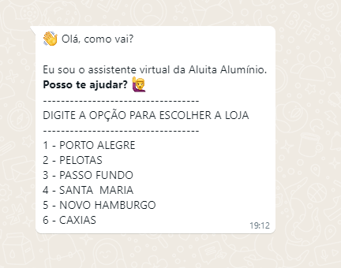
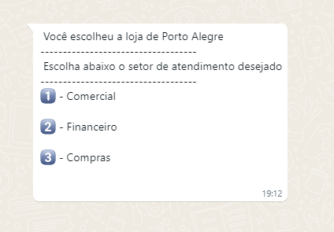

# Whatsapp Bot with VENOM-BOT

## Descrição do Projeto

<p align="center"></p>
<h1 align="center">
    <a href="https://nodejs.org/en/">🔗 NodeJS</a>
    <a href="https://www.npmjs.com/package/venom-bot">🧠 Venom Bot</a>
</h1>
<p align="center">🚀 Projeto criado para uso da empresa "Aluita Alumínio" para redirecionamento de atendimento via WhatsApp.</p>
<br>
<h1 align="center">
  Inicio
  
  Setor
  
</h1>

### Pré-requisitos

Antes de começar, você vai precisar ter instalado em sua máquina as seguintes ferramentas:
[Git](https://git-scm.com), [Node.js](https://nodejs.org/en/).
Além disto, é bom ter um editor para trabalhar com o código como [VSCode](https://code.visualstudio.com/).

### 🎲 Rodando nossa aplicação

```bash
# Clone este repositório
$ git clone github.com/Rkaspper/botwhatsapp-venom-aluita

# Acesse a pasta do projeto no terminal/cmd
$ cd botwhatsapp-venom-aluita

# Instale as dependências
$ npm install

# Execute a aplicação em modo de desenvolvimento
$ yarn dev

## Pronto, escaneie o código QR do Whatsapp e Voilà, aproveite!
```

### 🛠 Tecnologias

As seguintes ferramentas foram usadas na construção do projeto:

- [Node.js](https://nodejs.org/en/)